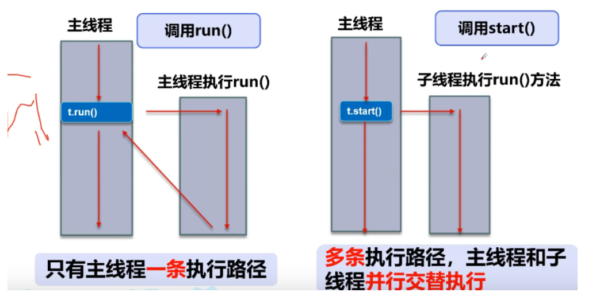

#### 进程（Process）

* 是执行程序的一次过程。

* 1个进程包含若干个线程（Thread），线程是CPU调度和执行的单位。

* 多线程是CPU分成时间块轮流执行的，真正的多线程是指多核CPU。

#### 线程（Thread）

* 线程就是独立的执行路径。
* 在程序运行时，即使没有自己创建线程，后台也会有多个线程，如主线程，gc线程；
* main（）称之为主线程，为系统的入口，用于执行整个程序
* 在一个进程中，如果开辟了多个线程，线程的运行有调度器安排调度，调度器是与操作系统紧密相关的，先后顺序是不能人为干预的。
* 对同一份资源操作时，会存在资源抢夺问题，需要加入并发控制；
* 线程会带来额外的开销，如cpu调度时间，并发控制开销。
* 每个线程在自己的工作内存交互，内存控制不当会造成数据不一致