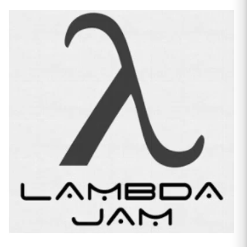

### 1.函数式接口（Funciontal Interface)：

* 任何接口，如果只包含唯一一个抽象方法，那么他就是一个函数式接口。

  ```java
  public interface Runnable{
      public abstract void run();
  }
  ```

  

* 对于函数式接口，可以通过lambda表达式来创建该接口的对象。

### 2.实现类

* 针对接口和抽象类而言，继承了接口和抽象类的非抽象类，就能说是实现类（其实就是要继承接口具体实现代码的类）

### 3.Lambda表达式：

* 对于函数式接口的实现类可以通过Lambda表达式进行简化。

* 是一种函数式编程,可以避免内部类定义过多，去掉了没有意义的代码，只保留核心的东西

* 比如以下例子

  ```java
  
  //1.定义一个函数式接口
  
  interface  ILike{
      void lambda();
  }
  public class TestLambda1 {
      	//通过lambda表达式，直接把实现类的方法体写在大括号中间。
          ILike like3 = () ->{
              System.out.println("I like lambda5");
          };
      	//调用函数式接口唯一的方法执行
          like3.lambda();
      }
  }
  
  ```

  



### ４.Lambda的简化过程

```java
package com.rzp.Lambda;

public class TestLambda1 {

    //3.静态内部类
    static class Like2 implements ILike{
        @Override
        public void lambda() {
            System.out.println("I like lambda2");
        }
    }


    public static void main(String[] args) {
        //通过1和2，普通的方式已经实现
        ILike like = new Like();
        like.lambda();


        //想要简化，通过静态内部类实现
        like = new Like2();
        like.lambda();

        //继续简化，通过局部内部类实现
        //4.局部内部类
        class Like3 implements ILike{
            @Override
            public void lambda() {
                System.out.println("I like lambda3");
            }
        }

        like = new Like3();
        like.lambda();


        //5.继续简化，匿名内部类(复习，没有类的名称，必须借助接口或者父类）
        like = new ILike() {
            @Override
            public void lambda() {
                System.out.println("I like lambda4");
            }
        };
        like.lambda();

        //6.jdk8出现后，可以用Lambda简化
        //lambda表达式就在于，Ilike这个接口是函数式接口，里面只有1个抽象方法
        // 因此函数式接口的实现类必然是为了实现这个方法，因此省略了实现类的创建代码
        //改成以下的形式，其实就是创建了一个匿名内部类和方法体，并new了一个对象like3用于执行方法
        ILike like3 = () ->{
            System.out.println("I like lambda5");
        };
        like3.lambda();
    }
}

//1.定义一个函数式接口

interface  ILike{
    void lambda();
}

//2.实现类
class  Like implements ILike{
    @Override
    public void lambda() {
        System.out.println("I like lambda");
    }
}
```

### 5.Lambda的继续简化

```java
package com.rzp.Lambda;

public class TestLambda2 {
    public static void main(String[] args) {
        Ilove l = (int a) ->{
            System.out.println("I love duidui! *"+a);
        };

        //简化1.参数类型(多个参数的时候，要去就都去)
        l = (a) ->{
            System.out.println("I love duidui! *"+a);
        };

        //简化2.括号(单个参数类型的时候)
        l = a ->{
            System.out.println("I love duidui! *"+a);
        };

        //简化3.去掉花括号（一行代码前提下）
        l = a -> System.out.println("I love duidui! *"+a);

        l.love(2);
    }
}

interface Ilove{
    void love(int a);
}

```

### 6.Thread的Lambda表达式解读

```java
        new Thread(()-> System.out.println("I love duiui")).start();

```

1. 查看Thread的构造器：

   ```java
       public Thread(Runnable target) {
           init(null, target, "Thread-" + nextThreadNum(), 0);
       }
   ```

2. ()-> System.out.println("I love duiui")相当于继承了runnable接口的对象。

