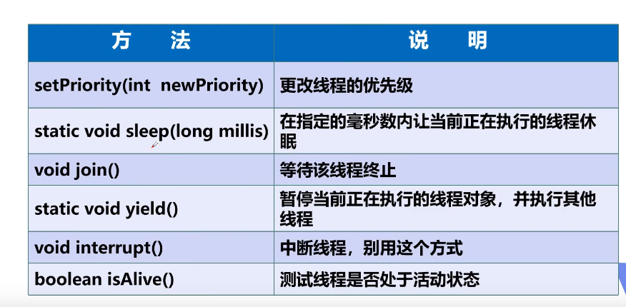

### 1.线程状态

1. NEW 创建状态，尚未启动的线程。
2. RUNNABLE 就绪状态，在Java虚拟机中执行的线程。
3. BLOCKED 阻塞状态，被阻塞等待件事情锁定的线程。
4. WATTING ，正在等待另一个线程执行特定动作的线程。
5. TIMED_WATTING ，正在等待另一个线程执行动作达到指定等待时间的线程。
6. TERMINATED 死亡状态，已退出的线程

### 2.线程方法

* 不建议使用的方法

