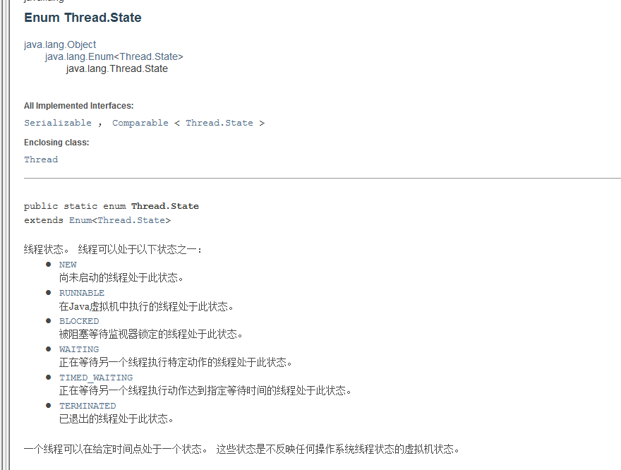

### 线程的状态State

#### State是Thread的内部类，定义了以下状态,说明线程的状态

1. NEW 创建状态，尚未启动的线程。
2. RUNNABLE 就绪状态，在Java虚拟机中执行的线程。
3. BLOCKED 阻塞状态，被阻塞等待件事情锁定的线程。
4. WATTING ，正在等待另一个线程执行特定动作的线程。
5. TIMED_WATTING ，正在等待另一个线程执行动作达到指定等待时间的线程。
6. TERMINATED 死亡状态，已退出的线程
   * 看api文档



### 观察线程的状态

* 通过Thread.getState()方法获取线程状态对象，赋值给State类的对象可以输出查看

```java
package com.rzp.thread10;

//观察线程状态
public class MoniterStatus {
    public static void main(String[] args) throws InterruptedException {
        Thread t1 = new Thread(()->{
            for (int i = 0; i < 5; i++) {
                try {
                    Thread.sleep(1000);
                } catch (InterruptedException e) {
                    e.printStackTrace();
                }
            }
            System.out.println("////////////////");
        });

        Thread.State state = t1.getState();
        System.out.println(state); //NEW

        //观察启动后
        t1.start();
        state = t1.getState();
        System.out.println(state); //RUN

        //只要线程不终止，就一直输出状态
        while (state!=Thread.State.TERMINATED){
            t1.sleep(100);
            state = t1.getState();
            System.out.println(state); //RUN
        }
    }
}

```

