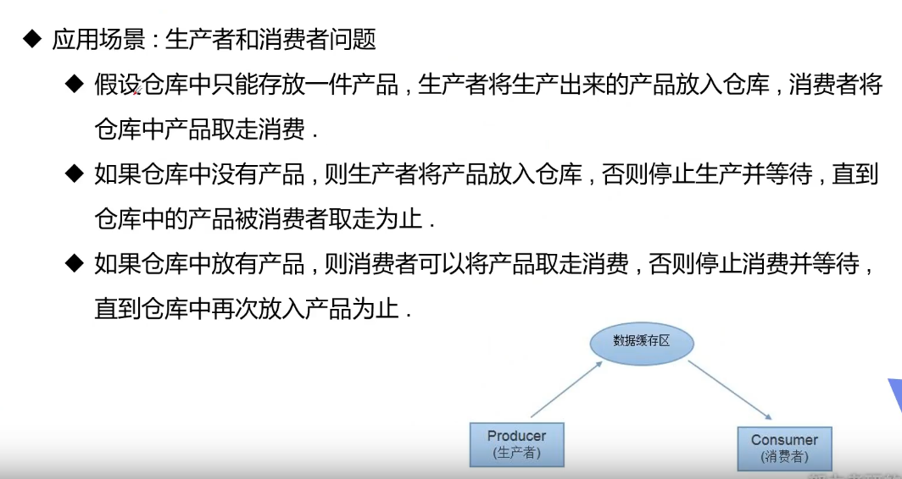

## 需求场景



## 问题分析

1. 无论生产者还是消费者，都需要在生产/消费后，马上通知另一方。
2. 因此只有synchronized是不够的，因为不能实现不同线程之间的同步.

## 解决方法

* ### Java提供了几个方法解决线程之间的通信

  1. wait() - 表示线程一直等待，直到其他线程通知，与sleep不同，会释放锁。
  2. wait(long x) - 指定等待的毫秒数
  3. notify() - 唤醒一个处于等待状态的线程
     * 唤醒当前对象的任意一个等待状态的线程。
  4. notifyAll() - 唤醒同一个对象上所有调用wait()方法的线程，优先级别高的线程优先调度。

### 1.管程法

* 在消费者和生产者中创建缓冲区，两者都和缓冲区交互，而不是和对方交互

```java
package com.rzp.thread12;

//测试，生产者消费者模型，通过管程法解决
public class TestPc {
    public static void main(String[] args) {
        Syncontainer t1 = new Syncontainer();
        new Productor(t1).start();
        new Consumer(t1).start();
    }
}


//生产者
class Productor extends Thread{
    Syncontainer syncontainer;

    public Productor(Syncontainer syncontainer) {
        this.syncontainer = syncontainer;
    }
    //生产

    @Override
    public void run() {
        for (int i = 0; i < 100; i++) {
            syncontainer.push(new Chicken(i));
            System.out.println("生产了"+i+"只鸡");
        }
    }
}

//消费者
class Consumer extends Thread{
    Syncontainer syncontainer;

    public Consumer(Syncontainer syncontainer) {
        this.syncontainer = syncontainer;
    }
    @Override
    public void run() {
        for (int i = 0; i < 100; i++) {
            System.out.println("消费了"+syncontainer.pop().id+"只鸡");
        }
    }

}

//产品
class  Chicken{
    int id;
    public Chicken(int id) {
        this.id = id;
    }
}

//缓冲区
class Syncontainer{

    //需要一个容器大小
    Chicken[] chickens = new Chicken[10];
    //容器计数器
    int count = 0;
    //生产者放入产品
    public synchronized void push(Chicken chicken){
        //如果容器满了，就需要等待消费者消费
        if (count == chickens.length){
            //通知消费者消费，生产等待
            try {
                this.wait();
            }catch (InterruptedException e){
                e.printStackTrace();
            }
        }
        if (count<=10){
        }
        //如果没有满，就需要放入产品
        chickens[count] = chicken;
        count++;

        //通知消费者消费
        this.notifyAll();
    }


    //消费者消费产品
    public synchronized Chicken pop(){
        //判断能否消费
        if (count==0){
            //等待生产者生产
            try {
                this.wait();
            } catch (InterruptedException e) {
                e.printStackTrace();
            }
        }

        //如果可以消费
        count--;
        Chicken chicken = chickens[count];
//        System.out.println("count"+count);
        //吃完了，通知生产者生产
        this.notifyAll();
        return chicken;
    }
}
```


### 2.信号灯法

* 通过标志位判断是否要生产/消费。

```java
package com.rzp.thread12;

//测试，生产者消费者模型
//信号灯法
public class TestPc2 {

    public static void main(String[] args) {
        TV tv = new TV();
        new Player(tv).start();
        new Watcher(tv).start();
    }
}

//生产者
class Player extends Thread{
    TV tv = new TV();

    public Player(TV tv) {
        this.tv = tv;
    }

    @Override
    public void run() {
        for (int i = 0; i < 20; i++) {
            if (i%2==0){
                this.tv.play("生活大爆炸");
            }else{
                this.tv.play("老秦讲Java");
            }
        }
    }
}

//消费者
class Watcher extends Thread{
    TV tv = new TV();

    public Watcher(TV tv) {
        this.tv = tv;
    }

    @Override
    public void run() {
        for (int i = 0; i < 20; i++) {
            tv.watch();
        }
    }
}

//产品
class  TV{
    //演员表演 t
    //观众观看 f
    String voice;
    boolean flag = true;

    //表演
    public synchronized void play(String voice){
        if (!flag){
            try {
                this.wait();
            }catch (InterruptedException e){
                e.printStackTrace();
            }
        }
        System.out.println("演员表演了"+voice);
        //通知观众观看
        this.notifyAll();
        this.voice = voice;
        this.flag = !this.flag;
    }

    //观看
    public synchronized void watch(){
        System.out.println("观看了"+voice);

        if (flag){
            try {
                this.wait();
            }catch (InterruptedException e){
                e.printStackTrace();
            }
        }
        //通知演员观看
        this.notifyAll();
        this.flag = !this.flag;

    }
}
```

